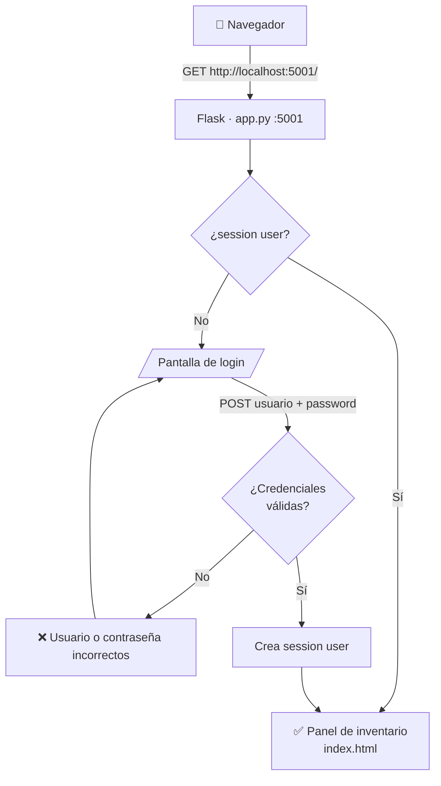
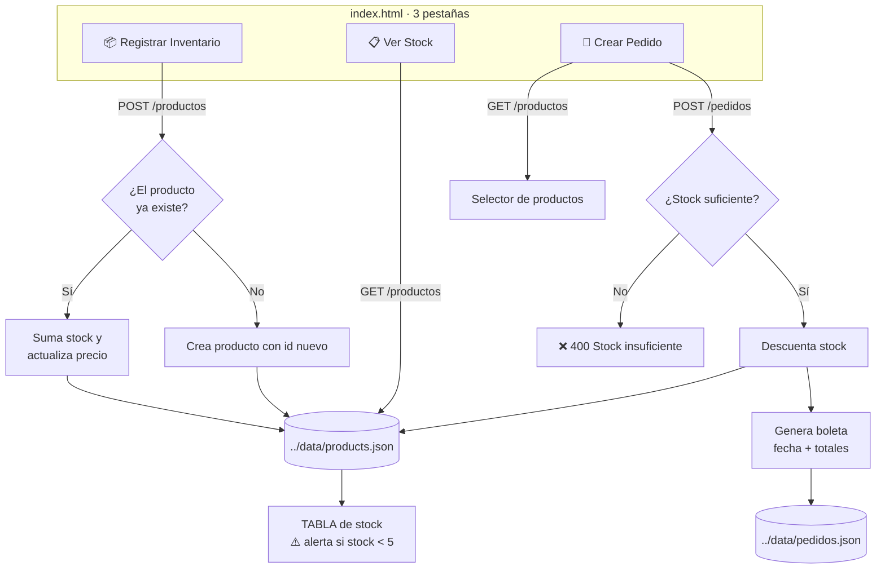

# 📦 FoodColor — Sistema de Gestión de Inventario

Panel **privado** para el personal autorizado de FoodColor: registro de productos, control de stock y creación de pedidos con boleta.

## ⚙️ Funcionamiento

La aplicación corre con **Flask en el puerto `5001`** (`http://localhost:5001`) y está protegida por **sesión de Flask** (solo personal autorizado).

| Método | Ruta | Protección | Descripción |
|--------|------|------------|-------------|
| `GET/POST` | `/login` | Pública | Formulario de acceso. Credenciales válidas crean `session["user"]` |
| `GET` | `/logout` | — | Cierra la sesión |
| `GET` | `/` | 🔒 Login | Sirve `index.html` (panel de inventario) |
| `GET` | `/styles.css` | Pública | Sirve la hoja de estilos compartida del panel |
| `GET` | `/productos` | 🔒 API | Lista los productos en JSON |
| `POST` | `/productos` | 🔒 API | Registra un producto. Si ya existe (mismo nombre), **suma stock** y actualiza precio |
| `POST` | `/pedidos` | 🔒 API | Valida stock → descuenta → genera boleta → guarda en `pedidos.json` |
| `GET` | `/pedidos` | 🔒 API | Lista las boletas emitidas |

- **Credenciales por defecto:** usuario `admin`, contraseña `foodcolor2026` (constante `USERS` en `app.py`).
- Los datos se guardan en la carpeta compartida **`../data/`** (raíz del proyecto): `products.json` y `pedidos.json`.
- El catálogo principal ([Pagina Main](../Pagina%20Main)) lee ese mismo `products.json`, así que los cambios se reflejan automáticamente.
- El frontend verifica cada 15 s que el servidor esté activo (indicador *SERVIDOR ACTIVO / SIN CONEXIÓN*) y redirige al login si la sesión expira (401).

## 📁 Estructura

```
Gestión de inventario/
├── app.py                                # Backend Flask actual (auth + API + sirve index.html)
├── index.html                            # Panel SPA: Registrar Inventario · Ver Stock · Crear Pedido
├── styles.css                            # Estilos del panel (servido vía ruta /styles.css)
├── templates/
│   └── login.html                        # Pantalla de acceso (Jinja2)
├── productos.json                        # Datos legacy de la versión anterior
└── Sistema_de_Gestión_de_inventario.py   # ⚠️ Versión antigua sin autenticación (no usar)
```

## 🔀 Diagramas de flujo

### Acceso al sistema



### Flujo de datos: productos y pedidos



## 🚀 Ejecución

```bash
cd "Gestión de inventario"
python app.py
# Abrir http://localhost:5001 e iniciar sesión
```

> ⚠️ No abrir `index.html` con doble clic: los `fetch` necesitan el servidor corriendo. Usar siempre la URL `http://localhost:5001`.

## 🔗 Relación con otros módulos

- **Escritura:** este módulo es quien crea/actualiza `data/products.json` y genera `data/pedidos.json`.
- **Lectura:** [`Pagina Main`](../Pagina%20Main) (`localhost:5000`) muestra esos productos al público.
