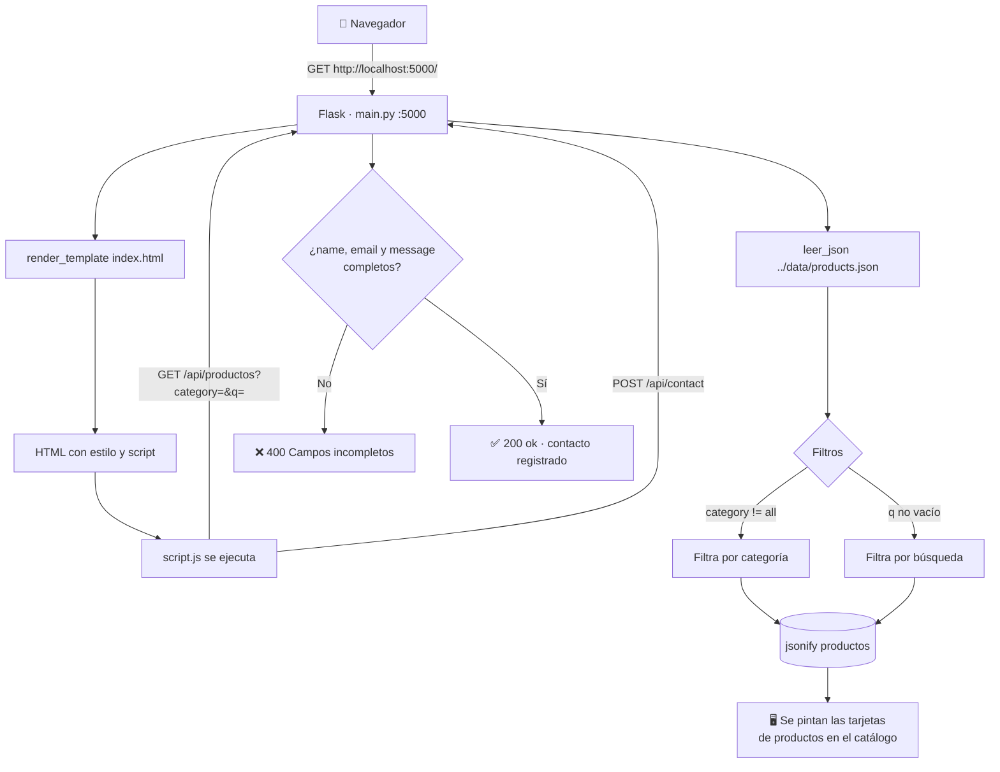

# 🎨 FoodColor — Página Principal (Catálogo)

Frontend público de la tienda **FoodColor**, distribuidora de colorantes alimenticios.
Muestra el catálogo de productos (colorantes, esencias, aditivos) consumiendo los datos expuestos por su propio backend Flask.

## ⚙️ Funcionamiento

La aplicación corre con **Flask en el puerto `5000`** (`http://localhost:5000`) y expone tres rutas:

| Método | Ruta | Descripción |
|--------|------|-------------|
| `GET` | `/` | Renderiza el catálogo principal (`templates/index.html`) |
| `GET` | `/api/productos` | Devuelve los productos en JSON. Acepta filtros opcionales: `?category=<cat>&q=<texto>` |
| `POST` | `/api/contact` | Recibe `{name, email, message}` del formulario de contacto. Valida campos y registra el contacto |

Los datos se leen desde el archivo compartido **`../data/products.json`** (raíz del proyecto), que es el mismo archivo que alimenta el sistema de gestión de inventario. De esta forma, cualquier producto registrado en el inventario aparece automáticamente en el catálogo.

El frontend (`static/script.js`) hace `fetch` a las APIs al cargar la página y ante cada cambio de categoría o búsqueda.

## 📁 Estructura

```
Pagina Main/
├── main.py              # Backend Flask (rutas, lectura de datos, filtros)
├── templates/
│   └── index.html       # Catálogo principal (Jinja2)
├── static/
│   ├── style.css        # Estilos del sitio
│   └── script.js        # Fetch a la API, render dinámico, formulario contacto
└── data/
    └── products.json    # Copia local de referencia
```

## 🔀 Diagrama de flujo



## 🚀 Ejecución

```bash
cd "Pagina Main"
python main.py
# Abrir http://localhost:5000
```

## 🔗 Relación con otros módulos

- **Lectura:** consume `data/products.json` de la raíz (solo lectura).
- **Escritura:** el módulo [`Gestión de inventario`](../Gestión%20de%20inventario) (`localhost:5001`) es quien crea y actualiza los productos en ese archivo.
